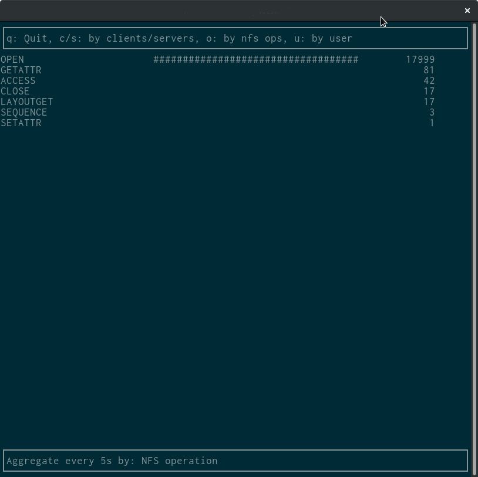

NFS-top
=======

Top like utility to show nfs traffic utilization




HowTo build
-----------

Pull the dependencies
```
$ go get -u github.com/gizak/termui
$ go get -u github.com/tsg/gopacket
$ go get -u github.com/patrickmn/go-cache
$ go get -u github.com/kofemann/linux_ftrace
```

And build:
```
$ go build
```

Done!


How to contribute
=================


**nfstop** uses the linux kernel model of using git not only a source
repository, but also as a way to track contributions and copyrights.

Each submitted patch must have a "Signed-off-by" line.  Patches without
this line will not be accepted.

The sign-off is a simple line at the end of the explanation for the
patch, which certifies that you wrote it or otherwise have the right to
pass it on as an open-source patch.  The rules are pretty simple: if you
can certify the below:
```

    Developer's Certificate of Origin 1.1

    By making a contribution to this project, I certify that:

    (a) The contribution was created in whole or in part by me and I
        have the right to submit it under the open source license
        indicated in the file; or

    (b) The contribution is based upon previous work that, to the best
        of my knowledge, is covered under an appropriate open source
        license and I have the right under that license to submit that
        work with modifications, whether created in whole or in part
        by me, under the same open source license (unless I am
        permitted to submit under a different license), as indicated
        in the file; or

    (c) The contribution was provided directly to me by some other
        person who certified (a), (b) or (c) and I have not modified
        it.

    (d) I understand and agree that this project and the contribution
        are public and that a record of the contribution (including all
        personal information I submit with it, including my sign-off) is
        maintained indefinitely and may be redistributed consistent with
        this project or the open source license(s) involved.

```
then you just add a line saying (with **git commit -s**)

    Signed-off-by: Random J Developer <random@developer.example.org>

using your real name (sorry, no pseudonyms or anonymous contributions.)
